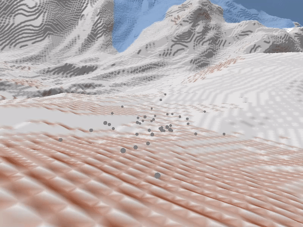
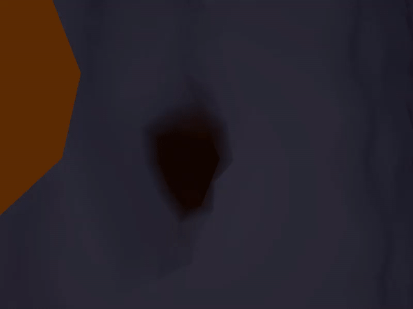

The following are a bunch of examples of the engine in work!

### Procedural Generation

The engine uses a 3d chunk map which allows for procedural generation in all axises, implementing FastNoises simd instruction for fast noise generation

### Destructibility

The engine allows for on the fly destructibility and creation of voxels on the fly, 

### Accurate Physics

The engine implements bullet3s physics engine, using a 1 to 1 collision mesh for the world which allows for very procise collision

### Real Time Shadows

The engine also implements Dynamic point and dirctional shadows to allow for an interesting and ever changing light scape

### And alot more
The engine also implements procedurally generate clouds and water waves which can be found throughout the environments.

Alot more in the works so stay tuned!

